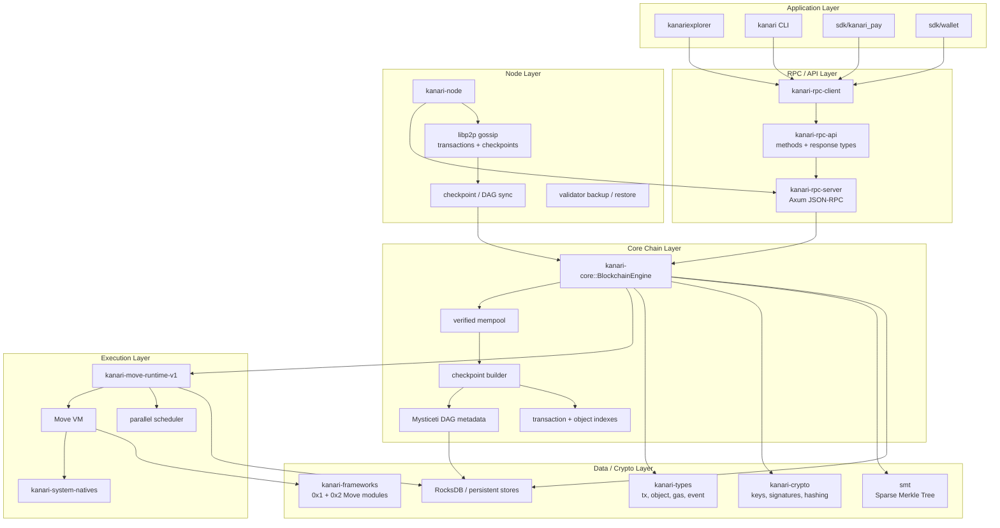
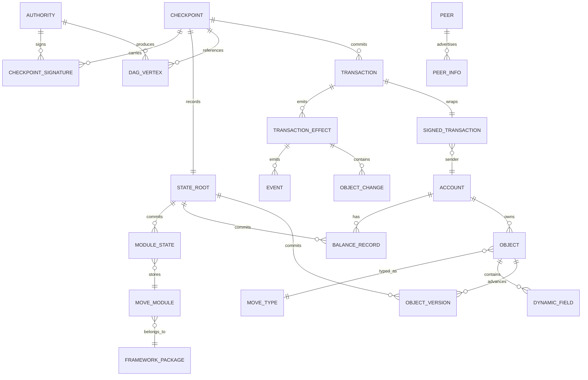

# Kanari SDK

Kanari SDK is a Rust and Move workspace for building, running, and integrating
the Kanari transaction network.

The current node architecture uses:

- Move VM execution through `kanari-move-runtime-v1`;
- Mysticeti DAG metadata and consensus integration;
- transaction-driven blockchain checkpoints;
- libp2p transaction and checkpoint propagation;
- JSON-RPC APIs and client SDKs;
- RocksDB-backed state and transaction indexes;
- Sparse Merkle Tree state roots.

## Design Requirement

Blockchain height represents committed transaction work.

- No transaction means no new checkpoint.
- No transaction means no height increment.
- Receiving a network DAG vertex does not directly create a checkpoint.
- Read-only API calls do not create transactions or checkpoints.
- Lagging nodes recover through checkpoint synchronization.
- Transaction counts represent unique committed signed transactions.

Read [Checkpoint and Height Design Invariants](crates/kanari-core/CHECKPOINT_DESIGN_INVARIANTS.md)
before changing core checkpoint, DAG, sync, state-root, or transaction-counting
behavior.

## Prerequisites

- Rust stable and Cargo
- Clang and LLVM
- CMake
- A C/C++ build toolchain supported by RocksDB
- PowerShell for the included Windows node scripts

Linux environments may also require `pkg-config` and OpenSSL development
packages.

## Build

Build the CLI:

```powershell
cargo build -p kanari
```

Build the node:

```powershell
cargo build -p kanari-node
```

Build an optimized node:

```powershell
cargo build -p kanari-node --release
```

## CLI

List local wallets:

```powershell
cargo run -p kanari -- keytool list
```

Create a Move package:

```powershell
cargo run -p kanari -- move new my_token
```

Test a Move package:

```powershell
cargo run -p kanari -- move test ./my_token
```

Publish a Move package through a running RPC node:

```powershell
cargo run -p kanari -- move publish --skip-fetch-latest-git-deps
```

See [Move CLI Guide](crates/kanari/MOVE_CLI_GUIDE.md) for additional commands.

## Run Four Local Nodes

The local scripts are in `crates/kanari-node`.

```powershell
cd crates/kanari-node
cargo build -p kanari-node
.\setup-multi-node.ps1 -NodeCount 4 -Network devnet -ResetSourceData -ResetReplicaData -ResetConsensusKeys
```

After the first clean setup, restart without reset flags to preserve state:

```powershell
.\setup-multi-node.ps1 -NodeCount 4 -Network devnet
```

Default RPC ports:

| Node | Authority | RPC |
|---|---|---|
| 1 | `0x1` | `19001` |
| 2 | `0x2` | `19011` |
| 3 | `0x3` | `19021` |
| 4 | `0x4` | `19031` |

Every validator requires a unique consensus private key and the shared authority
public-key map. The setup script generates local development keys when required.

See [Multi-Node Guide](crates/kanari-node/MULTI_NODE_GUIDE.md) for manual startup,
bootstrap peers, relay mode, and consensus-key handling.

## Transaction Lifecycle

```text
RPC submit
   |
   v
signature, replay, duplicate, and sequence validation
   |
   v
verified mempool
   |
   v
P2P transaction gossip
   |
   v
deterministic Move execution
   |
   v
Mysticeti-backed DAG metadata
   |
   v
checkpoint, state root, and transaction indexes
   |
   v
checkpoint synchronization for lagging nodes
```

The node waits for a short transaction gossip window before local checkpoint
production. This allows authorities to receive the same transaction batch.

Network DAG vertices are consensus metadata. They are stored and deduplicated,
but they do not directly execute transactions or increment blockchain height.

## ER Diagram and Layered Runtime Flow

The SDK is split into layers so that clients, RPC handling, consensus metadata,
Move execution, and persistent state can evolve independently while preserving
deterministic checkpoint output.


```mermaid
flowchart TB
    subgraph L0["Application Layer"]
        EXPLORER["kanariexplorer"]
        CLI["kanari CLI"]
        PAY["sdk/kanari_pay"]
        WALLET["sdk/wallet"]
    end

    subgraph L1["RPC / API Layer"]
        RPC_CLIENT["kanari-rpc-client"]
        RPC_API["kanari-rpc-api<br/>methods + response types"]
        RPC_SERVER["kanari-rpc-server<br/>Axum JSON-RPC"]
    end

    subgraph L2["Node Layer"]
        NODE["kanari-node"]
        P2P["libp2p gossip<br/>transactions + checkpoints"]
        SYNC["checkpoint / DAG sync"]
        BACKUP["validator backup / restore"]
    end

    subgraph L3["Core Chain Layer"]
        ENGINE["kanari-core::BlockchainEngine"]
        MEMPOOL["verified mempool"]
        CHECKPOINT["checkpoint builder"]
        DAG["Mysticeti DAG metadata"]
        INDEX["transaction + object indexes"]
    end

    subgraph L4["Execution Layer"]
        RUNTIME["kanari-move-runtime-v1"]
        VM["Move VM"]
        SCHED["parallel scheduler"]
        NATIVE["kanari-system-natives"]
    end

    subgraph L5["Data / Crypto Layer"]
        TYPES["kanari-types<br/>tx, object, gas, event"]
        CRYPTO["kanari-crypto<br/>keys, signatures, hashing"]
        SMT["smt<br/>Sparse Merkle Tree"]
        DB["RocksDB / persistent stores"]
        FRAMEWORKS["kanari-frameworks<br/>0x1 + 0x2 Move modules"]
    end

    EXPLORER --> RPC_CLIENT
    CLI --> RPC_CLIENT
    PAY --> RPC_CLIENT
    WALLET --> RPC_CLIENT

    RPC_CLIENT --> RPC_API
    RPC_API --> RPC_SERVER
    RPC_SERVER --> ENGINE

    NODE --> RPC_SERVER
    NODE --> P2P
    P2P --> SYNC
    SYNC --> ENGINE

    ENGINE --> MEMPOOL
    MEMPOOL --> CHECKPOINT
    CHECKPOINT --> DAG
    CHECKPOINT --> INDEX
    ENGINE --> RUNTIME

    RUNTIME --> VM
    RUNTIME --> SCHED
    VM --> NATIVE
    VM --> FRAMEWORKS

    ENGINE --> TYPES
    ENGINE --> CRYPTO
    ENGINE --> SMT
    ENGINE --> DB
    RUNTIME --> DB
    DAG --> DB
```


```mermaid
erDiagram
    AUTHORITY ||--o{ DAG_VERTEX : produces
    AUTHORITY ||--o{ CHECKPOINT_SIGNATURE : signs
    PEER ||--o{ PEER_INFO : advertises

    CHECKPOINT ||--o{ TRANSACTION : commits
    CHECKPOINT ||--o{ DAG_VERTEX : references
    CHECKPOINT ||--|| STATE_ROOT : records
    CHECKPOINT ||--o{ CHECKPOINT_SIGNATURE : carries

    TRANSACTION ||--|| SIGNED_TRANSACTION : wraps
    SIGNED_TRANSACTION }o--|| ACCOUNT : sender
    TRANSACTION ||--o{ TRANSACTION_EFFECT : emits
    TRANSACTION_EFFECT ||--o{ OBJECT_CHANGE : contains
    TRANSACTION_EFFECT ||--o{ EVENT : emits

    ACCOUNT ||--o{ OBJECT : owns
    ACCOUNT ||--o{ BALANCE_RECORD : has
    OBJECT ||--o{ OBJECT_VERSION : advances
    OBJECT ||--o{ DYNAMIC_FIELD : contains
    OBJECT }o--|| MOVE_TYPE : typed_as

    STATE_ROOT ||--o{ OBJECT_VERSION : commits
    STATE_ROOT ||--o{ BALANCE_RECORD : commits
    STATE_ROOT ||--o{ MODULE_STATE : commits

    MODULE_STATE }o--|| MOVE_MODULE : stores
    MOVE_MODULE }o--|| FRAMEWORK_PACKAGE : belongs_to
```

## Workspace Components

### Runtime and Consensus

- `crates/kanari-core`: execution, checkpoints, DAG integration, persistence
- `move-execution/v1/kanari-move-runtime-v1`: Move VM runtime and state manager
- `crates/mysticeti`: nested Mysticeti workspace used through path dependencies
- `crates/smt`: Sparse Merkle Tree and Merkle utilities
- `crates/kanari-db-common`: database helpers

### Node and RPC

- `crates/kanari-node`: validator node, libp2p networking, synchronization
- `crates/kanari-rpc-api`: JSON-RPC types and method names
- `crates/kanari-rpc-server`: RPC request handling
- `crates/kanari-rpc-client`: Rust RPC client
- `crates/kanari-indexer`: query indexing
- `crates/kanari-faucet`: faucet service

### Move and Frameworks

- `crates/kanari`: CLI and Move package commands
- `crates/kanari-frameworks`: released and source Move framework packages
- `crates/kanari-framework-builder`: framework build tooling
- `crates/kanari-system-natives`: Kanari native Move functions
- `third_party/move`: bundled Move toolchain dependencies

### Types, Crypto, and SDKs

- `crates/kanari-types`: transactions, blocks, addresses, events, gas types
- `crates/kanari-crypto`: keys, signatures, hashing, wallet cryptography
- `crates/kanari-auth`: authentication support
- `sdk/kanari_pay`: Kanari Pay Dart SDK and backend examples
- `sdk/wallet`: wallet SDK
- `packages/kanari_flutter`: Flutter integration

### Applications and Tooling

- `kanariexplorer`: network and transaction explorer
- `kanari-web`: web application
- `crates/kanari-benchmarks`: controlled execution benchmarks
- `crates/kanari-open-rpc*`: OpenRPC generation and specifications

## Persistence

Node data is stored under the configured `--data-dir`. Local scripts use
directories below `%USERPROFILE%\.kanari`.

Do not delete node data for a normal restart. Reset data only when intentionally
starting a fresh network or repairing an incompatible local development state.

Persistent state includes:

- Move state;
- blockchain checkpoint metadata;
- transaction payloads and hash indexes;
- Mysticeti DAG metadata;
- consensus identity configuration outside the database.

Private consensus keys must not be committed to git or shared between
authorities.

## Safety

The runtime verifies:

- signed transaction integrity;
- duplicate and replay protection;
- per-sender sequence ordering;
- checkpoint sequence continuity;
- checkpoint transaction signatures;
- state roots during synchronization;
- optional strict persistence and supply invariants;
- explicit consensus signing keys.

Do not disable correctness checks to improve benchmark results.

State-root differences at the same committed height are not expected. Different
DAG vertex or checkpoint hashes may be acceptable only when committed state and
transaction history remain identical.

## Test

Core and node checks:

```powershell
cargo check -p kanari-core -p kanari-node -p kanari-rpc-server
cargo test -p kanari-core
cargo test -p kanari-node sync::tests
```

Run a specific crate:

```powershell
cargo test -p kanari-types
```

Run the complete workspace when required:

```powershell
cargo test --workspace
```

For consensus or synchronization changes, also run a four-node restart test:

1. Start four authorities.
2. Confirm idle height remains unchanged.
3. Submit transactions through one RPC endpoint.
4. Confirm all nodes converge on height, unique transaction count, and state
   root.
5. Stop and restart all nodes without resetting data.
6. Confirm restart creates no extra transaction or checkpoint.

## Benchmarks

Use `kanari-benchmarks` for controlled measurements.

Performance depends on:

- CPU and memory;
- debug or release build;
- transaction type and Move workload;
- sender conflicts;
- batch size;
- storage and persistence settings;
- network topology.

TPS and latency results must include the command, workload, hardware, build
profile, and measurement boundary. A benchmark result is not automatically a
mainnet throughput or finality guarantee.

## Documentation

- [Kanari Core](crates/kanari-core/README.md)
- [Checkpoint Design Invariants](crates/kanari-core/CHECKPOINT_DESIGN_INVARIANTS.md)
- [Multi-Node Guide](crates/kanari-node/MULTI_NODE_GUIDE.md)
- [Move CLI Guide](crates/kanari/MOVE_CLI_GUIDE.md)
- [Frameworks](crates/kanari-frameworks/README.md)
- [SMT](crates/smt/README.md)
- [System ER Diagram](DOCS/SYSTEM_ER.md)
- [Merkle Trees](DOCS/MERKLE_TREES.md)
- [Developer Book](documentation/book/)
- [Whitepaper](documentation/whitepaper/)

## Contributing

See [CONTRIBUTING.md](CONTRIBUTING.md).

## License

Copyright (c) KanariNetwork, Inc.

SPDX-License-Identifier: Apache-2.0
