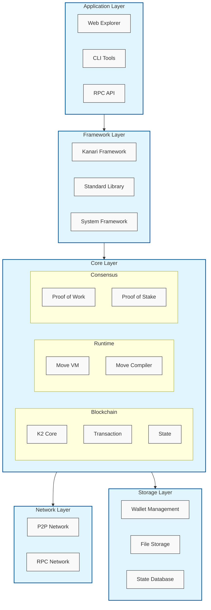

Kanari SDK

# Kanari SDK Architecture



### 1. Setup Environment
- Ensure you have Ubuntu or a similar Linux distribution.
- Install necessary dependencies like `build-essential`, `curl`, `clang`, `gcc`, `libssl-dev`, `llvm`, `make`, `pkg-config`, `tmux`, `xz-utils`, `ufw` using the provided `build_ubuntu.sh` script.

### 2. Install Rust
- Rust is required for building and running the Kari chain. Use the command provided in the `build_ubuntu.sh` script to install Rust and its package manager, Cargo.

### 3. Clone the Kari Chain Repository
- Obtain the source code for Kari chain. This might involve cloning a Git repository or downloading source code from a specific location.

### 4. Build the Project
- Navigate to the project directory.
- Run `cargo build --release` to compile the project. This command compiles the project in release mode, optimizing the binary for performance.

### 5. Run the Node
- After building, you can start a Kari chain node using `cargo run --release`. This command runs the compiled project.
- Depending on the project's specifics, you might need to add additional flags or configuration files to successfully start a node.

### 6. Interact with the Kari Chain
- Use the provided tools and documentation to interact with the Kari chain. This could involve sending transactions, mining blocks, or querying the blockchain state.

### 7. Update and Maintain
- Regularly update your local repository with the latest changes from the main Kari chain source.
- Rebuild the project as needed to ensure you're running the latest version.

### Usage Example
```shell
# Update and install dependencies
./build_ubuntu.sh

# Clone the Kari chain repo 
git clone  https://github.com/kanari-network/kanari-sdk.git
cd kanari-network

# Initialize and update submodules
git submodule init
git submodule update --init --recursive

# Build the project
cargo build --release
```

### Environment Setup
```shell

# Generate wallet
cargo run --release --bin kari keytool generate

# Configure and start node
# Interactive prompts will ask for:
# 1. Node type (enter 1 for validator)
# 2. RPC port (default: 3031)
# 3. Network domain (default: devnet.kari.network)
cargo run --release --bin kari start

# Start Kari node
# Windows
cargo run --release --bin kari start

# Linux/MacOS
cargo run --release --bin kari start
```

### Kari CLI Install

#### Prerequisites for Windows
- Install [Visual Studio Build Tools](https://visualstudio.microsoft.com/visual-cpp-build-tools/)
- Install [Rust](https://www.rust-lang.org/tools/install)
- Install MinGW via chocolatey:
```shell
choco install mingw
```
```shell
cargo install --locked --git https://github.com/kanari-network/kanari-sdk.git --branch main kari
```
