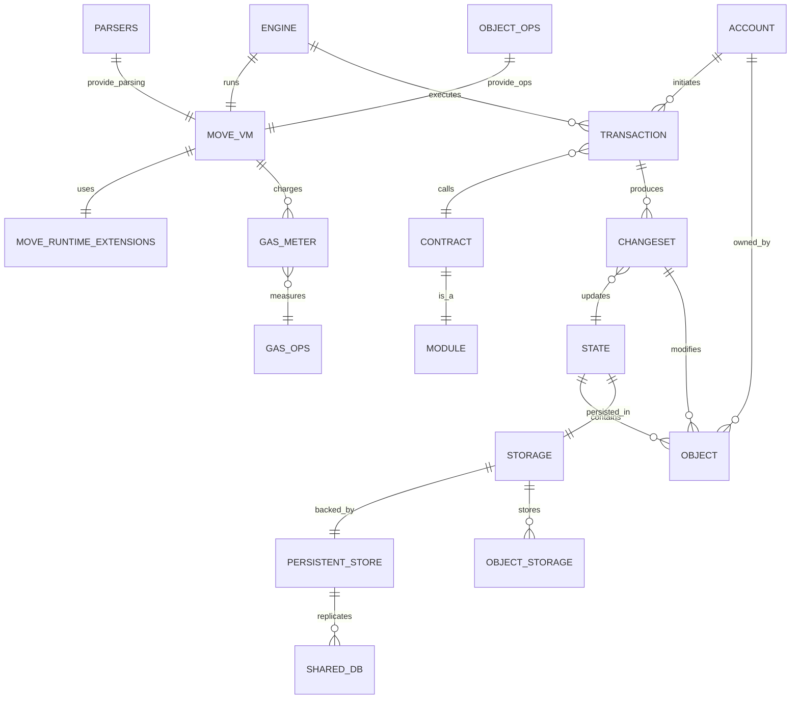
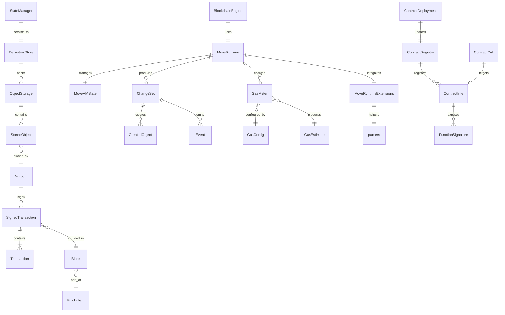
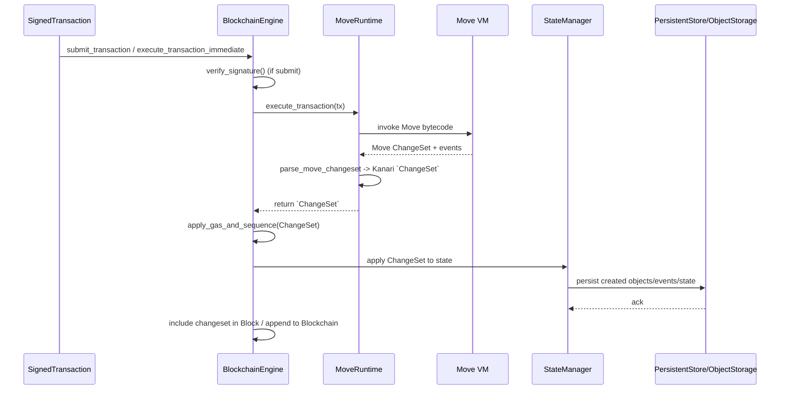

# ER Diagram — kanari-move-runtime

This document shows an Entity-Relationship (ER) style diagram describing the main components and data flows inside the `kanari-move-runtime` crate.

The diagram below uses Mermaid's `erDiagram` syntax — GitHub and many editors render this automatically.

## ER Diagram — kanari-move-runtime (aligned to `src/` types)

This document presents an ER-style view of the main runtime components and their relationships, using the actual public types from `crates/kanari-move-runtime/src/`.

## Types → source mapping (with line links)

- `BlockchainEngine`: [src/engine.rs#L18](src/engine.rs#L18)
- `MoveRuntime`: [src/move_runtime/mod.rs#L33](src/move_runtime/mod.rs#L33)
- `MoveVMState`: [src/storage/move_vm_state.rs#L18](src/storage/move_vm_state.rs#L18)
- `StateManager`: [src/state.rs#L75](src/state.rs#L75)
- `CreatedObject`: [src/changeset.rs#L10](src/changeset.rs#L10)
- `Event`: [src/changeset.rs#L21](src/changeset.rs#L21)
- `AccountChange`: [src/changeset.rs#L30](src/changeset.rs#L30)
- `ChangeSet`: [src/changeset.rs#L67](src/changeset.rs#L67)
- `SignedTransaction`: [src/blockchain.rs#L14](src/blockchain.rs#L14)
- `Transaction` (enum): [src/blockchain.rs#L88](src/blockchain.rs#L88)
- `Block`: [src/blockchain.rs#L208](src/blockchain.rs#L208)
- `Blockchain`: [src/blockchain.rs#L262](src/blockchain.rs#L262)
- `PersistentStore`: [src/storage/persistent_store.rs#L16](src/storage/persistent_store.rs#L16)
- `ObjectStore` trait: [src/storage/object_storage.rs#L15](src/storage/object_storage.rs#L15)
- `StoredObject`: [src/storage/object_storage.rs#L27](src/storage/object_storage.rs#L27)
- `ObjectStorage`: [src/storage/object_storage.rs#L36](src/storage/object_storage.rs#L36)
- `ContractInfo`: [src/contract.rs#L15](src/contract.rs#L15)
- `ContractRegistry`: [src/contract.rs#L183](src/contract.rs#L183)
- `ContractCall`: [src/contract.rs#L257](src/contract.rs#L257)
- `ContractDeployment`: [src/contract.rs#L333](src/contract.rs#L333)
- `GasConfig`: [src/gas.rs#L8](src/gas.rs#L8)
- `GasOperation`: [src/gas.rs#L35](src/gas.rs#L35)
- `GasMeter`: [src/gas.rs#L104](src/gas.rs#L104)
- `GasEstimate`: [src/gas.rs#L168](src/gas.rs#L168)
- `MoveRuntimeExtensions` (helpers/impls): [src/move_runtime_extensions.rs#L17](src/move_runtime_extensions.rs#L17)
- `RuntimeStats`: [src/move_runtime_extensions.rs#L172](src/move_runtime_extensions.rs#L172)

### Short notes

- `BlockchainEngine` orchestrates execution and applies `ChangeSet`s produced by `MoveRuntime`.
- `MoveRuntime` wraps the Move VM logic and interacts with `MoveVMState`, `GasMeter`, and storage backends.
- `StateManager` provides higher-level state operations and persists via `PersistentStore` / `ObjectStorage`.
- `ChangeSet` contains created/modified objects and emitted events; these are persisted by the storage layer.

### Next steps (optional)

- Expand the diagram to a sequence diagram showing a full transaction lifecycle (`SignedTransaction` → `BlockchainEngine` → `MoveRuntime` → `ChangeSet` → persistence).
- Add direct links to type definitions (line numbers) for quicker navigation.

---

### Transaction sequence diagram (lifecycle)

### Sequence → implementation mapping (links to definitions)

- `submit_transaction` / `execute_transaction_immediate`: [src/engine.rs#L90](src/engine.rs#L90) / [src/engine.rs#L104](src/engine.rs#L104)
- `verify_signature`: [src/blockchain.rs#L14](src/blockchain.rs#L14) (SignedTransaction methods)
- `execute_transaction`: [src/engine.rs#L130](src/engine.rs#L130)
- `apply_gas_and_sequence`: [src/engine.rs#L72](src/engine.rs#L72)
- Move runtime execution and parsing: [src/move_runtime/mod.rs#L33](src/move_runtime/mod.rs#L33) and [src/move_runtime/parsers.rs#L11](src/move_runtime/parsers.rs#L11)
- State application: `StateManager` apply helpers: [src/state.rs#L75](src/state.rs#L75)
- Persistence backends: `PersistentStore`: [src/storage/persistent_store.rs#L16](src/storage/persistent_store.rs#L16) and `ObjectStorage`: [src/storage/object_storage.rs#L36](src/storage/object_storage.rs#L36)

### Additional method/function links (useful entry points)

- `MoveRuntime::new_with_kanari_natives`: [src/move_runtime/mod.rs#L111](src/move_runtime/mod.rs#L111)
- `MoveRuntime::new_with_natives`: [src/move_runtime/mod.rs#L67](src/move_runtime/mod.rs#L67)
- `MoveRuntime::publish_module`: [src/move_runtime/mod.rs#L148](src/move_runtime/mod.rs#L148)
- `MoveRuntime::publish_module_bundle`: [src/move_runtime/mod.rs#L243](src/move_runtime/mod.rs#L243)
- `parse_move_changeset`: [src/move_runtime/parsers.rs#L11](src/move_runtime/parsers.rs#L11)
- `parse_move_events`: [src/move_runtime/parsers.rs#L142](src/move_runtime/parsers.rs#L142)
- `MoveRuntime::apply_gas_info` (gas ops helper): [src/move_runtime/gas_ops.rs#L14](src/move_runtime/gas_ops.rs#L14)
- `StateManager::get_or_create_account`: [src/state.rs#L125](src/state.rs#L125)
- `MoveVMState::open_default`: [src/storage/move_vm_state.rs#L44](src/storage/move_vm_state.rs#L44)
- `MoveVMState::save_module`: [src/storage/move_vm_state.rs#L59](src/storage/move_vm_state.rs#L59)
- `MoveVMState::load_into_storage`: [src/storage/move_vm_state.rs#L74](src/storage/move_vm_state.rs#L74)
- `ObjectStorage::store_object`: [src/storage/object_storage.rs#L99](src/storage/object_storage.rs#L99)
- `ObjectStorage::get_object`: [src/storage/object_storage.rs#L148](src/storage/object_storage.rs#L148)
- `ObjectStorage::get_objects_by_owner`: [src/storage/object_storage.rs#L174](src/storage/object_storage.rs#L174)
- `PersistentStore::open_default`: [src/storage/persistent_store.rs#L22](src/storage/persistent_store.rs#L22)
