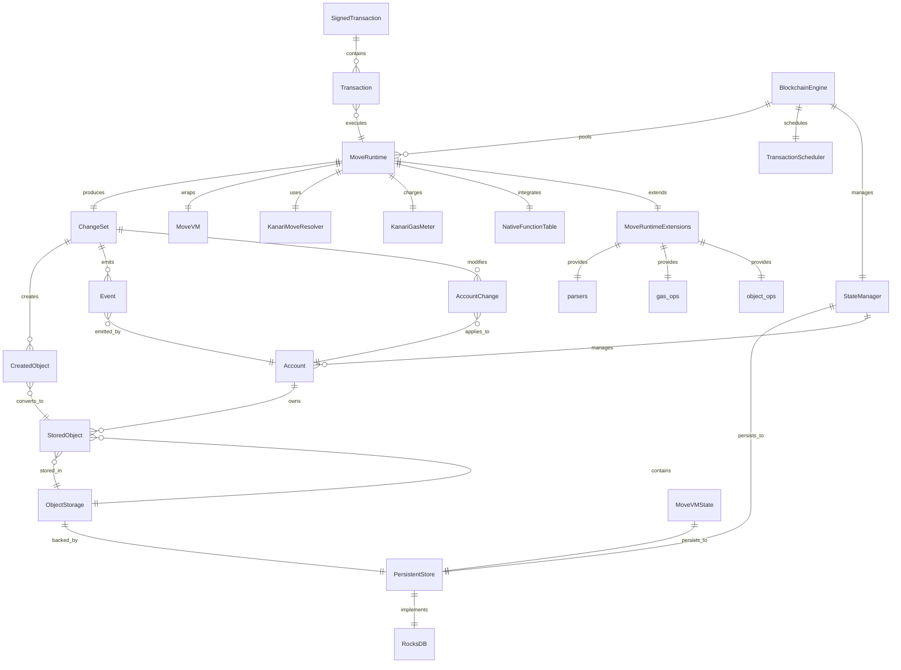
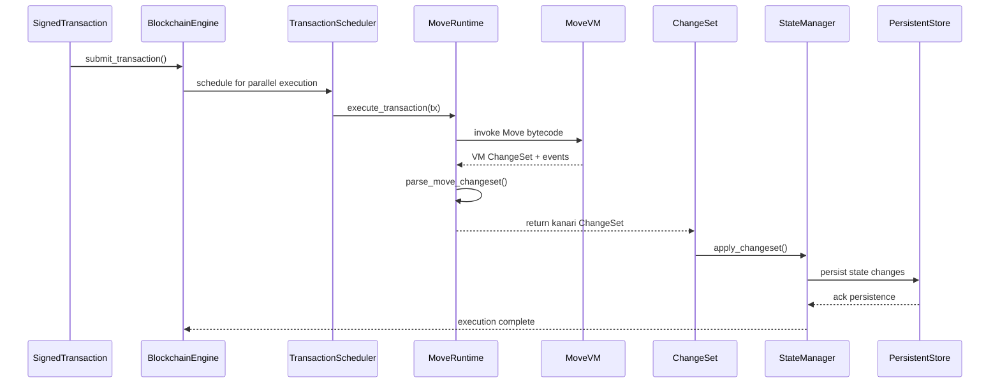
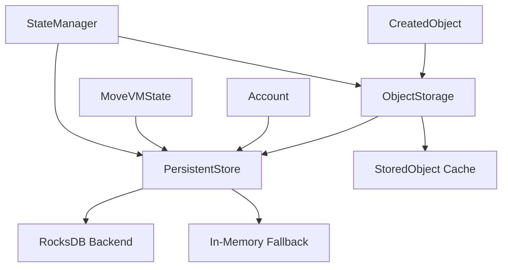

# ER Diagram — kanari-move-runtime

This document shows an Entity-Relationship (ER) style diagram describing the main components and data flows inside the `kanari-move-runtime` crate.

The diagram below uses Mermaid's `erDiagram` syntax — GitHub and many editors render this automatically.

## Detailed Component Relationships

### 1. Transaction Execution Pipeline

### 2. Storage Architecture

## Types → Source Mapping (with line links)

### Core Execution Types

- **MoveRuntime**: [src/move_runtime/mod.rs#L33](src/move_runtime/mod.rs#L33)
- **SignedTransaction**: [crates/kanari-types/src/transaction.rs](../../crates/kanari-types/src/transaction.rs)
- **Transaction**: [crates/kanari-types/src/transaction.rs](../../crates/kanari-types/src/transaction.rs)
- **ChangeSet**: [src/changeset.rs#L67](src/changeset.rs#L67)
- **CreatedObject**: [src/changeset.rs#L14](src/changeset.rs#L14)
- **Event**: [crates/kanari-types/src/event.rs](../../crates/kanari-types/src/event.rs)
- **AccountChange**: [src/changeset.rs#L26](src/changeset.rs#L26)

### State Management

- **StateManager**: [src/state.rs#L75](src/state.rs#L75)
- **Account**: [src/state.rs#L28](src/state.rs#L28)
- **PersistentStore**: [src/storage/persistent_store.rs#L69](src/storage/persistent_store.rs#L69)
- **ObjectStorage**: [src/storage/object_storage.rs#L106](src/storage/object_storage.rs#L106)
- **StoredObject**: [src/storage/object_storage.rs#L127](src/storage/object_storage.rs#L127)
- **MoveVMState**: [src/storage/move_vm_state.rs#L18](src/storage/move_vm_state.rs#L18)

### Gas & Metering

- **KanariGasMeter**: [src/kanari_gas_meter.rs#L9](src/kanari_gas_meter.rs#L9)
- **GasOperation**: [crates/kanari-types/src/gas_v2.rs](../../crates/kanari-types/src/gas_v2.rs)

### Runtime Extensions

- **MoveRuntimeExtensions**: [src/move_runtime/move_runtime_extensions.rs#L17](src/move_runtime/move_runtime_extensions.rs#L17)
- **parsers** module: [src/move_runtime/parsers.rs#L11](src/move_runtime/parsers.rs#L11)
- **gas_ops** module: [src/move_runtime/gas_ops.rs#L14](src/move_runtime/gas_ops.rs#L14)
- **object_ops** module: [src/move_runtime/object_ops.rs#L11](src/move_runtime/object_ops.rs#L11)
- **RuntimeStats**: [src/move_runtime/move_runtime_extensions.rs#L172](src/move_runtime/move_runtime_extensions.rs#L172)

### Engine & Scheduling

- **BlockchainEngine**: [crates/kanari-core/src/engine.rs#L42](../../crates/kanari-core/src/engine.rs#L42)
- **TransactionScheduler**: [src/scheduler.rs#L12](src/scheduler.rs#L12)
- **KanariMoveResolver**: [src/storage/resolver.rs#L10](src/storage/resolver.rs#L10)

### Key Method Entry Points

#### MoveRuntime Methods

- `new_with_kanari_natives()`: [src/move_runtime/mod.rs#L111](src/move_runtime/mod.rs#L111)
- `publish_module()`: [src/move_runtime/mod.rs#L148](src/move_runtime/mod.rs#L148)
- `publish_module_bundle()`: [src/move_runtime/mod.rs#L243](src/move_runtime/mod.rs#L243)
- `execute_function()`: [src/move_runtime/mod.rs#L350](src/move_runtime/mod.rs#L350)

#### StateManager Methods

- `get_or_create_account()`: [src/state.rs#L125](src/state.rs#L125)
- `apply_changeset()`: [src/state.rs#L200](src/state.rs#L200)
- `compute_state_root()`: [src/state.rs#L450](src/state.rs#L450)
- `commit()`: [src/state.rs#L500](src/state.rs#L500)

#### Storage Methods

- `PersistentStore::open_default()`: [src/storage/persistent_store.rs#L76](src/storage/persistent_store.rs#L76)
- `ObjectStorage::store_object()`: [src/storage/object_storage.rs#L148](src/storage/object_storage.rs#L148)
- `ObjectStorage::get_object()`: [src/storage/object_storage.rs#L198](src/storage/object_storage.rs#L198)
- `ObjectStorage::get_objects_by_owner()`: [src/storage/object_storage.rs#L224](src/storage/object_storage.rs#L224)
- `MoveVMState::save_module()`: [src/storage/move_vm_state.rs#L59](src/storage/move_vm_state.rs#L59)

#### Parsing & Helpers

- `parse_move_changeset()`: [src/move_runtime/parsers.rs#L11](src/move_runtime/parsers.rs#L11)
- `parse_move_events()`: [src/move_runtime/parsers.rs#L142](src/move_runtime/parsers.rs#L142)
- `apply_gas_info()`: [src/move_runtime/gas_ops.rs#L14](src/move_runtime/gas_ops.rs#L14)

## Architecture Notes

### Design Principles

1. **Separation of Concerns**:
   - `MoveRuntime` handles VM execution logic
   - `StateManager` manages application-level state
   - `PersistentStore` provides durable storage abstraction
   - `ObjectStorage` handles Move objects specifically

2. **Parallel Execution Support**:
   - `TransactionScheduler` enables optimistic parallel execution
   - `BlockchainEngine` maintains a pool of `MoveRuntime` instances
   - Conflict detection prevents race conditions

3. **Storage Flexibility**:
   - RocksDB for production persistence
   - In-memory fallback for testing/Miri
   - Overlay mechanism for speculative execution

4. **Gas Metering**:
   - `KanariGasMeter` acts as step counter (not coin deduction)
   - Prevents DoS attacks and infinite loops
   - Zero-cost transactions (gas paid by infrastructure)

### Data Flow Summary

1. **Transaction Submission**: `SignedTransaction` → `BlockchainEngine` → `TransactionScheduler`
2. **Execution**: `MoveRuntime` → `MoveVM` → `ChangeSet`
3. **State Update**: `ChangeSet` → `StateManager` → `PersistentStore` / `ObjectStorage`
4. **Persistence**: All state changes committed to RocksDB via `PersistentStore`

### Next Steps (Optional Enhancements)

- Add performance metrics tracking for each component
- Document conflict resolution strategies in `TransactionScheduler`
- Expand on the overlay mechanism for speculative execution
- Add detailed error handling flow diagrams
