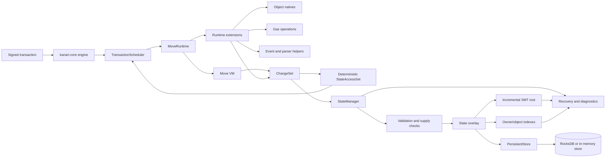
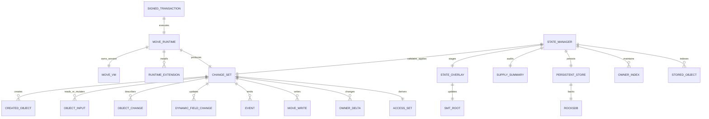
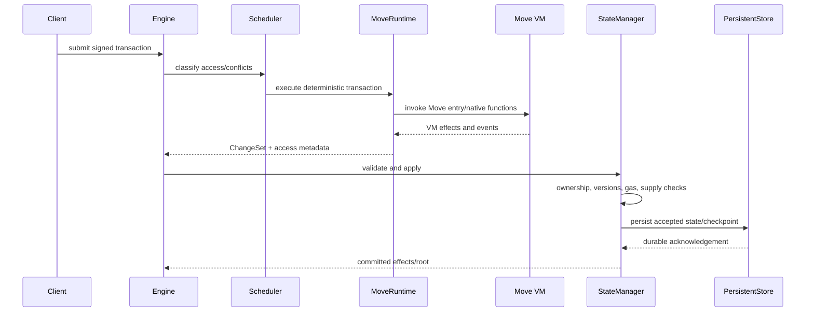

# Kanari Move Runtime v1: Current Architecture

This diagram reflects the current crate boundaries and data flow. It intentionally avoids source line numbers because those become stale as the runtime evolves.

## Component relationship



## Entity relationship view



## Execution sequence



## Current data objects

### ChangeSet

The changeset is the canonical execution output. It includes owner deltas, native gas credits, events, treasury/NFT capability updates, token balance sets, object references, created/deleted objects, explicit object changes, dynamic-field changes, Move writes, resolver-read metadata, gas usage, success, and error information.

### CreatedObject

A created object carries owner, owner kind, optional UID/ID records, type, serialized data, version, and a derived digest/object reference.

### StateAccessSet

The access set contains deterministic read/write keys. A write conflicts with another transaction's read or write of the same key. Unknown writes are conservatively fenced to preserve deterministic replay.

### StateManager and PersistentStore

`StateManager` owns overlay, root, indexes, supply metadata, and changeset application. `PersistentStore` abstracts RocksDB/in-memory persistence and recovery markers. Derived indexes and caches are not substitutes for canonical state.

## Invariants represented by the diagram

```text
1. A VM result is not committed until StateManager validation succeeds.
2. A failed changeset cannot partially mutate canonical state.
3. Mutable object conflicts are ordered, not silently parallelized.
4. Incremental SMT root equals full recomputation for the same state.
5. total_supply = circulating_supply + object_locked_supply + untracked_supply.
6. Correctly tracked operations finish with untracked_supply = 0.
7. Recovery must converge on checkpoint, root, object indexes, and supply.
```

## Source navigation

The main implementation surfaces are directly linked here:

- [`StateManager`](./src/state.rs)
- [`ChangeSet` and `StateAccessSet`](./src/changeset.rs)
- [`changeset application`](./src/state/apply.rs)
- [`supply accounting`](./src/state/supply.rs)
- [`TransactionScheduler`](./src/scheduler.rs)
- [`KanariGasMeter`](./src/kanari_gas_meter.rs)
- [`MoveRuntime and native extensions`](./src/move_runtime/)
- [`persistent store`](./src/storage/persistent_store.rs)
- [`object storage`](./src/storage/object_storage.rs)
- [`Move VM resolver`](./src/storage/resolver.rs)

Use repository search for current symbols rather than relying on line-number links:

```text
rg "struct ChangeSet|struct StateAccessSet|struct StateManager" move-execution/v1/kanari-move-runtime-v1/src
rg "apply_changeset|compute_state_root|commit" move-execution/v1/kanari-move-runtime-v1/src
```

## Test navigation

The behavior tests are grouped by responsibility:

- [`state tests`](./tests/unit/state_tests.rs)
- [`changeset tests`](./tests/unit/changeset_tests.rs)
- [`object operation tests`](./tests/unit/object_ops_tests.rs)
- [`object storage tests`](./tests/unit/object_storage_tests.rs)
- [`scheduler tests`](./tests/unit/scheduler_tests.rs)
- [`Move VM state tests`](./tests/unit/move_vm_state_tests.rs)
- [`runtime tests`](./tests/unit/move_runtime_tests.rs)
- [`persistent state`](./tests/state_persistence.rs)
- [`state-root/module commitment`](./tests/state_root_module_commitment.rs)
- [`inflation regression`](./tests/repro_inflation.rs)
- [`mint consolidation`](./tests/test_mint_consolidation.rs)
- [`dynamic fields`](./tests/dynamic_field_cross_transaction.rs)
- [`dynamic object fields`](./tests/dynamic_object_field_cross_transaction.rs)
- [`publish/upgrade`](./tests/publish_upgrade.rs)

Run the current suite from the repository root:

```text
cargo test -p kanari-move-runtime-v1 --tests -- --test-threads=2
```

The diagram is descriptive documentation. Deterministic behavior,
compatibility, and security are defined by the current source, tests, and
migration policy.
