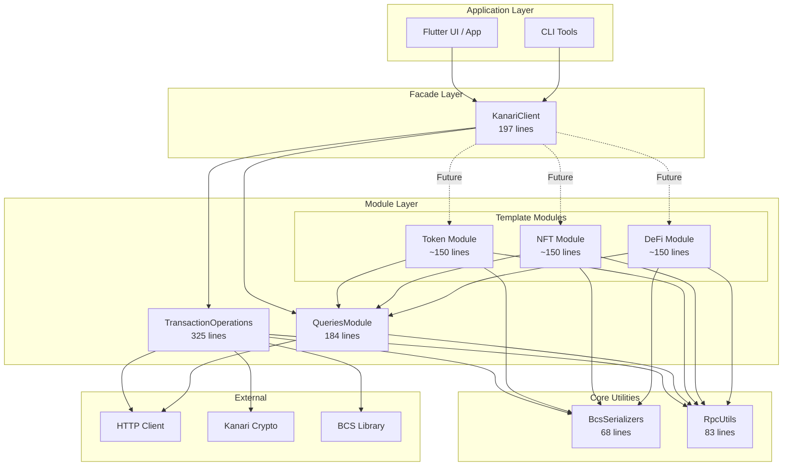
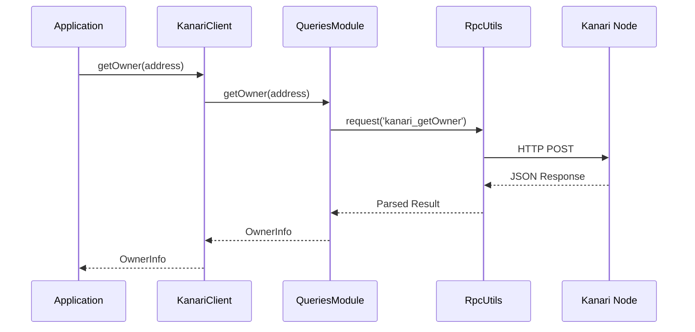
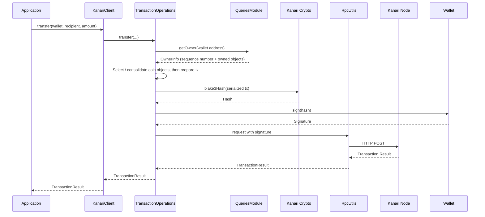
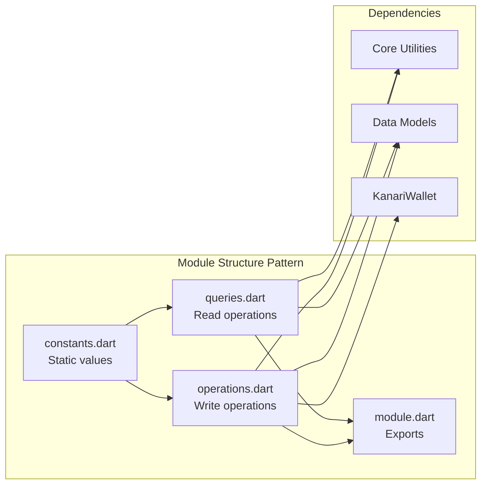
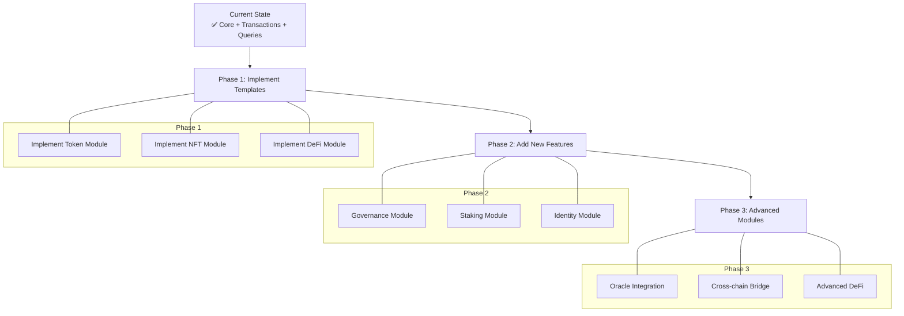

# Architecture Diagram

## 📊 Module Dependency Flow



## 🔄 Request Flow

### Query Operation (Read)



### Transaction Operation (Write)



## 📁 File Organization

```
lib/src/
│
├── 🎭 Facade Layer
│   └── kanari_client.dart (197 lines)
│       ├── Delegates to modules
│       ├── Maintains backward compatibility
│       └── Provides unified API
│
├── 🔧 Core Utilities (Shared by all modules)
│   ├── bcs_serializers.dart (68 lines)
│   │   ├── hexToBytes()
│   │   ├── encodeU64()
│   │   ├── normalizeAddress()
│   │   └── extractCoinTypeFromObjectType()
│   │
│   └── rpc_utils.dart (83 lines)
│       ├── request() - Generic RPC call
│       └── executeViewFunction() - View function helper
│
└── 📦 Feature Modules
    │
    ├── ✅ transactions/ (Implemented)
    │   ├── constants.dart - RPC methods, gas settings
    │   ├── operations.dart (305 lines)
    │   │   ├── publishModule()
    │   │   ├── transfer()
    │   │   ├── executeFunction()
    │   │   ├── burn()
    │   │   └── transferToken()
    │   └── transactions.dart - Barrel file
    │
    ├── ✅ queries.dart (184 lines) - Implemented
    │   ├── getAccount()
    │   ├── getBalance()
    │   ├── getTokenBalance()
    │   ├── getAllBalances()
    │   ├── getCheckpoint()
    │   ├── getCheckpointHeight()
    │   ├── getTransaction()
    │   ├── getStats()
    │   ├── getHealth()
    │   ├── getModule()
    │   ├── listModules()
    │   └── verifyModule()
    │
    ├── 📝 tokens/ (Template Ready)
    │   ├── constants.dart - Token package addresses, functions
    │   ├── operations.dart - createCurrency, mint, burn, split, merge
    │   ├── queries.dart - getSupply, getMetadata, getUserCoins
    │   └── tokens.dart - Barrel file
    │
    ├── 📝 nft/ (Template Ready)
    │   ├── constants.dart - Collection/NFT addresses, functions
    │   ├── operations.dart - createCollection, mintNft, transferNft
    │   ├── queries.dart - getCollectionDetails, getNftMetadata
    │   └── nft.dart - Barrel file
    │
    ├── 📝 defi/ (Template Ready)
    │   ├── constants.dart - DEX/Lending addresses, functions
    │   ├── operations.dart - swap, addLiquidity, removeLiquidity
    │   ├── queries.dart - getQuote, getReserves, getLpBalance
    │   └── defi.dart - Barrel file
    │
    └── modules.dart - Central barrel file
        └── Exports all modules
```

## 🎯 Module Communication Pattern



## 📈 Growth Strategy



## 🔑 Key Principles

1. **Single Responsibility**: Each module has one clear purpose
2. **Separation of Concerns**: Read vs Write operations separated
3. **Dependency Injection**: Modules receive dependencies (url, client, queries)
4. **Barrel Files**: Clean exports for easy importing
5. **Backward Compatibility**: Existing API maintained through facade
6. **Template Pattern**: Consistent structure across all modules
7. **Core Reusability**: Shared utilities prevent code duplication

---

**Architecture Version**: 2.0.0  
**Last Updated**: 2026-05-12  
**Status**: Production Ready ✅
